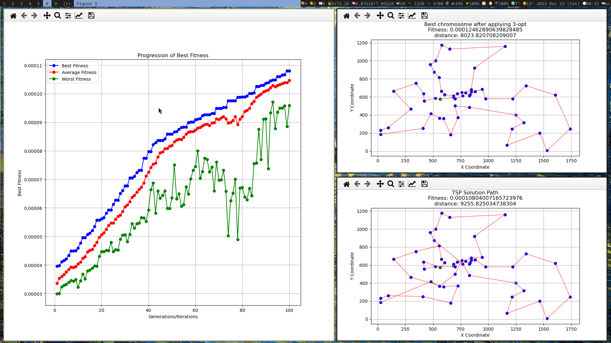
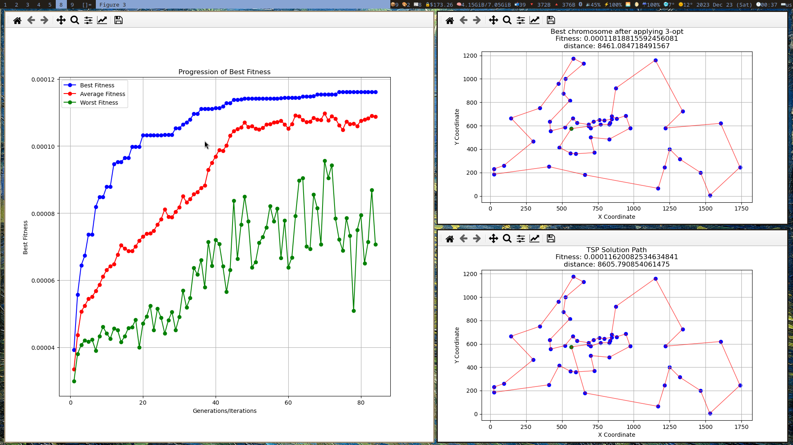

# TSP
simple and module TSP project written in python

# Usage

move to the project directory and run the following command:

```bash
python core.py
```

* config file

The configuration of project can be done using a `config.yaml` file. The first found `config.yaml` file in the project directory will be used.

All the configuration, even the Input file is stored in the `config.yaml` file.

Currently, all the fields in the `config.yaml` file are required.

* Input file format

the input file should be a text file with the following format:

```text
...
NODE_COORD_SECTION
<node_id> <x> <y>
...
EOF
```

# Example output

The following image is the output of the project for the `berlin52` dataset.





# Credits

- [Ali Daghighi](https://github.com/alidaghighi) for Cycle Crossover implementation
- [Ali Daghighi](https://github.com/alidaghighi) for plot tsp cities dynamic
- Mahyar Teymournezhad for the idea of storing city distances in a matrix
